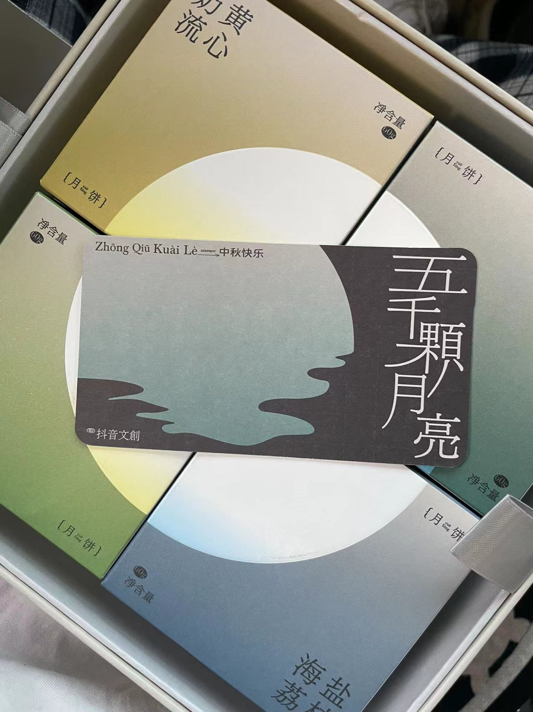
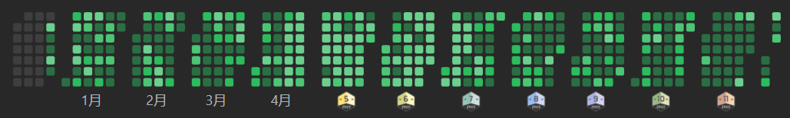

「回顾2022，展望2023，我正在参与2022年终总结征文大赛活动」  

(生活总结，非技术总结。
## 1.掘金
&emsp;今年4月报名青训营，得知了掘金的存在，后来慢慢就成为我这个自闭怪的摸鱼空间了：  
### 礼盒+周边  
&emsp; 个人觉得最nice的还属中秋礼盒，当时应该有不少掘友抽奖中过（愣着干嘛，梭哈啊）：

### 掘友  
&emsp; 我这人有时候自闭怪一个，加过一些活动的小群，后来加每个圈子的群。平常水水圈子，参加圈子活动。  
&emsp; 最有收获的属于游戏圈组织的那一次王者荣耀比赛的活动了——我两年没玩王者荣耀，抱着纯纯凑热闹的心理，找了个队混替补，结果发现群里的人全都很nice。  
&emsp; 比赛虽说替补，有一场还真用上我了:我微信区没铭文，没英雄，玩个辅助被揍的，专挑我打。队友也是真大腿，四个带一个，最后还赢了。  
## 2.我
### 学习  
&emsp; 我大学那会是搞IoT的，51单片机，Arduino，树莓派都搞过一会，读研后开始学java。现在实验室用C++，用ns2，ns3搞网络仿真的，java全靠自学。  
&emsp; 这一年处于还在积累的状态，但是时间不多了…唯一有成就感的事是养成天天做题的习惯：一天两道，偶尔开专项，也算佛系刷法了。
&emsp; 在做的研究不想谈，LoRa仿真，对研究不感兴趣，只想逃。
### 被“困”日本第三年
#### ~2022
&emsp; 19年9月参加学校的合作办学项目，来日本学校学习两年——大三上，一学期十一门课；12月，订了日本回国的机票，1月底终于熬过考试周后，yq爆发。当时日本并不严重，但是家里人万般劝阻，为了家里人健康还是选择了假期不回去。  
&emsp; 后来，酒店隔离开始自费，熔断机制导致机票价格飙升，回国可以，但是由于日本依旧封国，回不来。一段时间加上日本摇摆不定的入境政策，一直没考虑回国的事情。加上时间成本和金钱的花费，对于回国这件事也就没那么强烈了。
&emsp; 21年9月毕业后选择继续留在大学的研究室；这一年我表弟也来日本留学，加上周围很多同学已经三四年没回国，依然选择假期不回国。
#### 2022
&emsp; 今年冬天冬天：我妈亲姐的丈夫，跟淋巴癌斗争了四年后去世了。我爸的嫂子由于脑溢血也变得瘫痪卧床；我爸的亲哥由于心血管疾病动了一次大手术（现在恢复的不错）；最无语的是，我亲姐被误诊癌症；关系很好的邻居老奶奶去世等等…  
&emsp; 这种消息当时几乎每周都会从电话的另一端传来，加上我容易胡思乱想，让我那段时间精神紧绷，很怕某一天自己的父母一声招呼不打的也突然离开。有时候会做噩梦，梦到父母突然离世，哭醒以后看着空无一人的房间。  
&emsp; 这一年夏天，我学长毕业了，他在学习方面给过我特别多的建议。
> &emsp; 对于过去的一年，还有我们在世上生活的这些年，总要有句结束语：虽然人生在世会有种种不如意，但你仍可以在幸福与不幸中作选择。