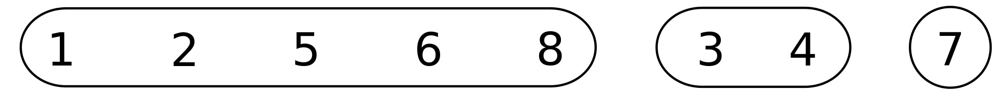

## 什么是并查集？  
> &emsp; 并查集(Disjoint-set data structure)是一种数据结构，用于解决**不交集**问题的合并及查询问题。它还有几个英文名叫：Union-find data structure / merge–find set(中文就是：合并-查找数据结构)。  
 
 &emsp; 为什么叫**合并-查询数据结构**？因为并查集有三个功能：  
1. **添加**  
2. **合并**  
3. **查询**  

&emsp; 以维基百科的例子为例:  
> 现在有数字1-8共八个元素，每个元素是一个集合：
>   
> 
> **合并**操作几次后，一些集合合并到了一起：
>   

&emsp; 这就是并查集，其实很简单。其主要的作用就是**合并**和**查找**。  
&emsp; 其最常见的实现是不交集森林。但是为了方便解释，接下来用一个数组实现的力扣题目来说明。

## [力扣990题](https://leetcode.cn/problems/satisfiability-of-equality-equations/ "力扣990.等式方程的可满足性")
> 题目：**等式方程的可满足性**  
> 
> &emsp;给定一个由表示变量之间关系的字符串方程组成的数组，每个字符串方程 equations[i] 的长度为 4，并采用两种不同的形式之一："a==b" 或 "a!=b"。在这里，a 和 b 是小写字母（不一定不同），表示单字母变量名。   
> &emsp;只有当可以将整数分配给变量名，以便满足所有给定的方程时才返回 true，否则返回 false。   

 示例1：
> **输入：** ["a==b","b!=a"]  
> **输出：** false  
> **解释：** 如果我们指定，a = 1 且 b = 1，那么可以满足第一个方程，但无法满足第二个方程。没有办法分配变量同时满足这两个方程。  
> 
示例2：
> **输入：** ["b==a","a==b"]  
> **输出：** true  
> **解释：** 我们可以指定 a = 1 且 b = 1 以满足满足这两个方程。  

## 题解[Java] (感谢Lee215大佬提供的题解)：
&emsp;990这道题由于最大只有26个小写字母，所以可以使用数组来实现**并查集**。  
&emsp;具体思路（并查集的三个功能）：
1. **添加：** 建立大小为26的int数组,名为uf；得到大小为26的数组，并让每个位置对应一个英文字母，即：  
   &emsp;从```'a'-'z'```对应```uf[0] - uf[25]```，即：```uf[0] = 0```，```uf[1] = 1```……```uf[25]=25```分别代表26个字母，也得到了26个集合。
2. **合并：** 将符合 ```==```关系的合并到一个集合中，实现：  
   &emsp; 例如，我们想将```'a'```对应的集合```uf[0]```与```'b'```对应的集合```uf[1]```合并，只需让：```uf[0] = 1```  
   &emsp; 这样当我们查看```'a'```对应的```uf[0]```的值时，即可发现集合```'a'```与集合```'b'```是合并的。
3. **查找：** 查找只需要从数组uf的一个位置开始，便可以知道该位置对应的字母与哪些字母合并过。

&emsp;在建立并查集后，本题只需要查看所有```!=```关系中的字母，是否在并查集中被合并到了一个集合。
```java
class Solution {
    int[] uf = new int[26];
    public boolean equationsPossible(String[] equations) {
        //添加并查集；uf[0]到uf[25]分别对应从'a'到'z'的26个小写字母
        for(int i = 0; i < 26; i++){
            uf[i] = i;
        }
        //合并；合并“==”关系的字母：使用find()方法查询到集合的最后一个字母，将其合并
        for(String s : equations){
            if(s.charAt(1) == '='){
                uf[find(s.charAt(0) - 'a')] = find(s.charAt(3) - 'a');
            }
        }
        //遍历并查集，使用find()方法找到每个集合最尾端的字母，
        //判断最尾端字母是否相同来判断“!=”两边的字母是否位于一个集合内
        for(String s : equations){
            if(s.charAt(1) == '!'){
                if(uf[find(s.charAt(0) - 'a')] == uf[find(s.charAt(3) - 'a')])
                    return false;
            }
        }
        return true;
    }
    //查找；寻找属于同一集合的最尾端的字母，将其返回
    private int find(int idx){
        if(uf[idx] != idx){
            uf[idx] = find(uf[idx]);
        }
        return uf[idx];
    }
}
```


> 如有遗漏或错误，欢迎补充纠正