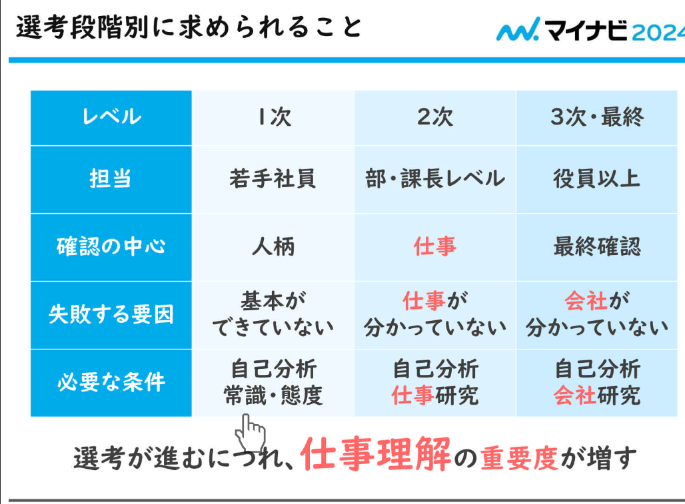
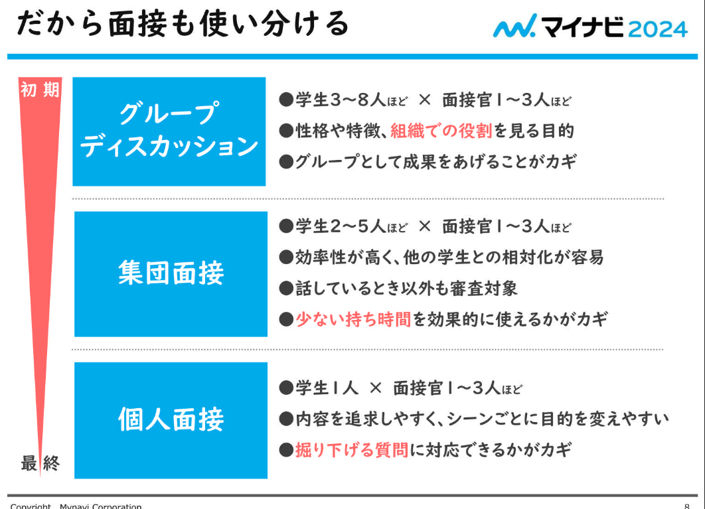
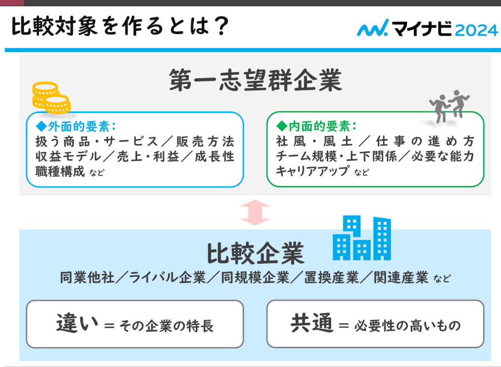
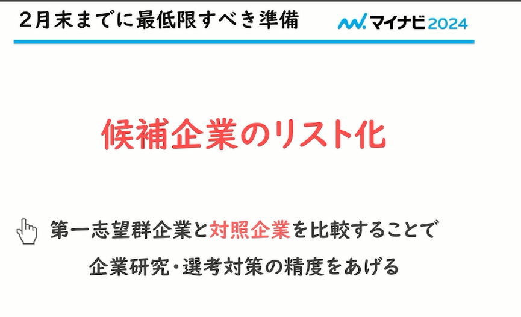
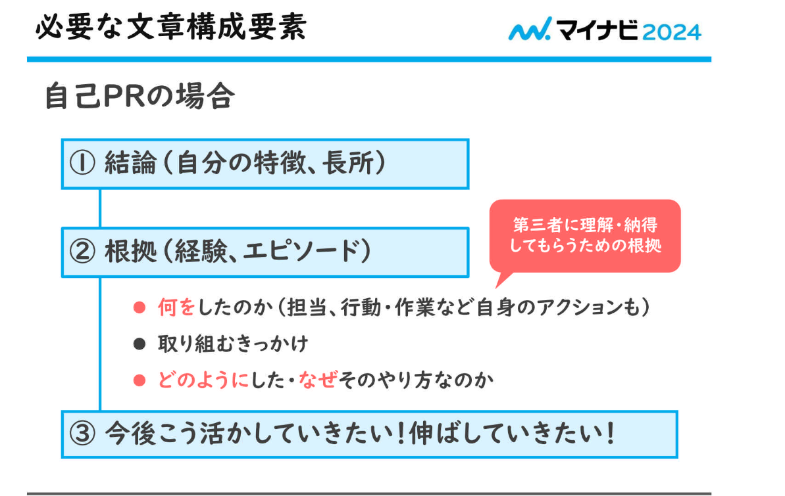
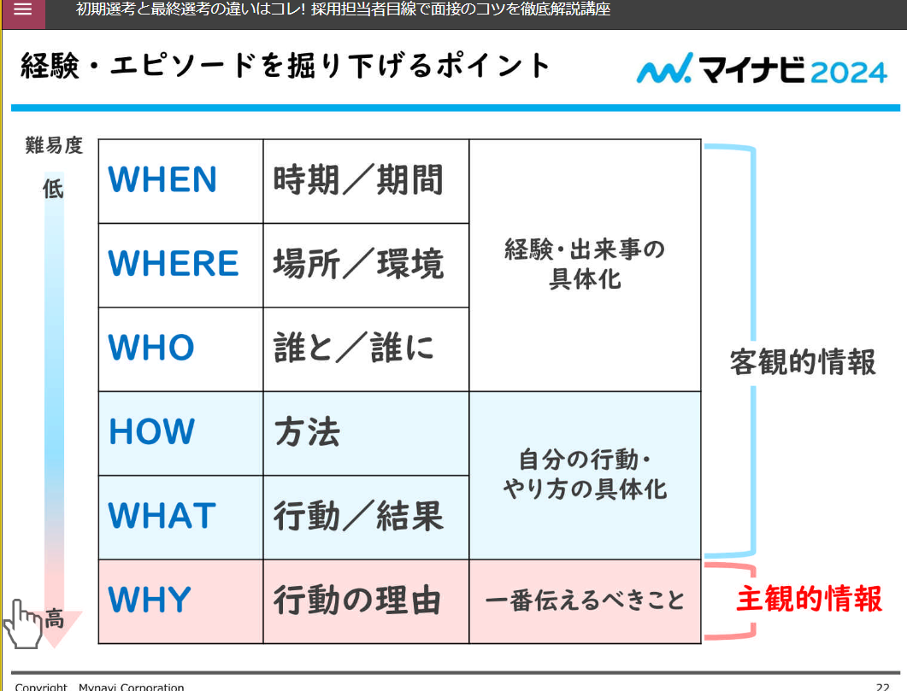
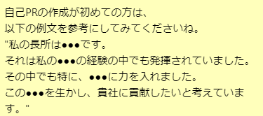
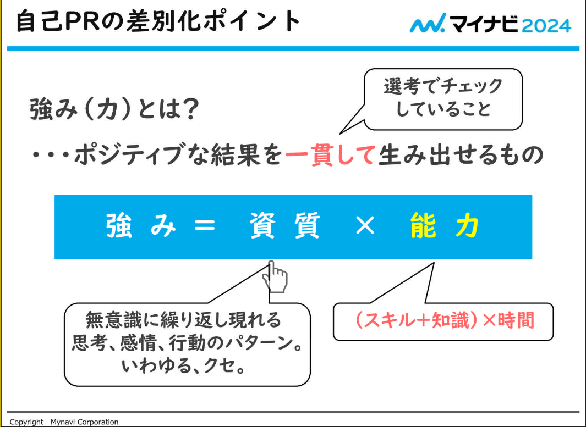
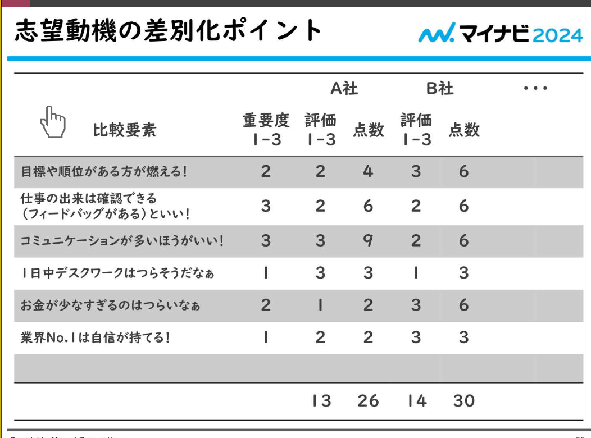

## 選考段階による違いと共通点：

まず、「**強み、特長、学生時代に最も力を入れたこと**」をまとめる。

**志望理由**：仕事を**知らない**前提

&emsp;面接が三回を例に：

&emsp;面接の形式：

## 最終選考に向けた準備：

&emsp;２月末までに最低限すべき準備：

## 自己PR希望動機レベルアップ：

&emsp;自己PRの例文：

&emsp;強み（力）は？

&emsp;志望動機の差別化ポイント：

