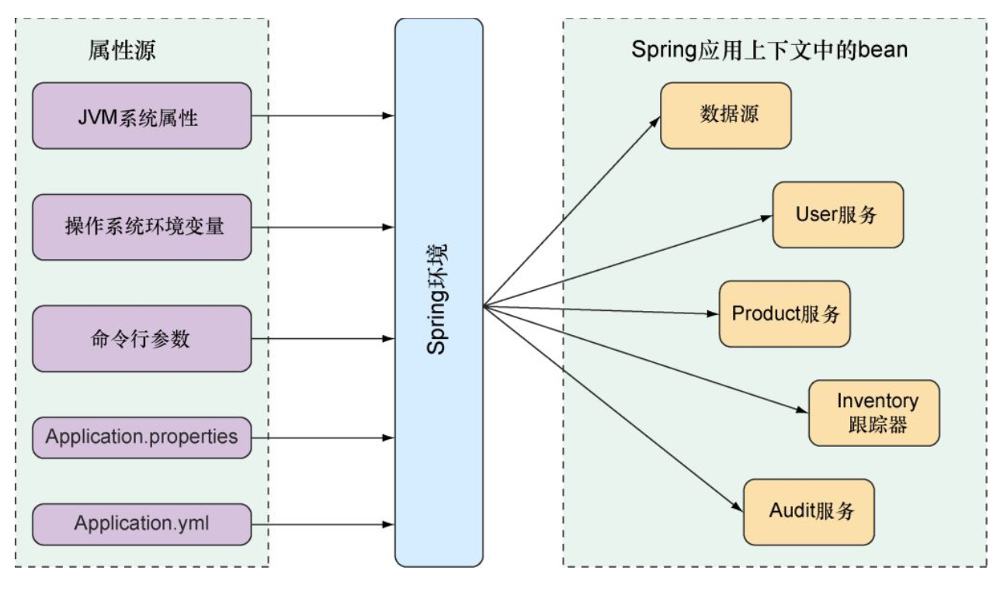

&emsp;第六章内容第五版与第六版几乎相同。本章介绍了自动配置bean；创建自己的配置属性；使用profile进行配置。

## 自动配置
### 细粒度的自动配置
**两种不同但相关的配置**  
1. Bean wiring（装配bean）：声明在Spring应⽤上下⽂中创建哪些应⽤组件以及它们应该如何相互注入。  
2. Property injection（依赖注入）声明在Spring应⽤上下⽂中创建哪些应⽤组件以及它们应该如何相互注入。

&emsp;在Spring的XML和Java配置中，这两种类型的配置通常在同一个地方**显式声明**。  
&emsp;在Java配置中，带@bean注解的方法很可能既实例化一个bean，又给它的属性赋值。举例来说，@Bean方法为H2数据库声明一个数据源：
```	
@Bean
public DataSource dataSource() {
    return new EmbeddedDatabaseBuilder()
        .setType(H2)
        .addScript("taco_schema.sql")
        .addScripts("user_data.sql", "ingredient_data.sql")
        .build();
}
```
```addScript()``` 和 ```addScripts()```方法通过设置String属性来确定数据源——**这是不使用Spring Boot的配置方法。**  
&emsp;如果在运行时类路径中能够找到H2依赖，那么**Spring Boot会自动在Spring应用上下文中创建对应的DataSource bean**。这个bean会运行名为```schema.sql```和```data.sql```的脚本。

### Spring的环境抽象
**Spring的环境抽象**  
&emsp;Spring环境会拉取多个属性源：
* JVM系统属性
* 操作系统环境变量
* 命令行参数
* 应用属性配置文件

&emsp;将这些属性聚合到一个源中，通过这个源可以注入到spring的bean中。如下图所示：

&emsp;Spring boot自动配置的bean都可以通过spring环境提取的属性进行配置.  
例如，希望底层Servlet容器使用另一个端口监听，有以下四个不同的方法：
1. “src/main/resources/application.properties”将server.port设置成一个不同的端口：server.port = 9090
2. “src/main/resources/application.yml”中: server : port : 9090
3. 命令行参数启动时指定端口：$ java -jar tacocloud-0.0.5-SNAPSHOT.jar --server.port=9090
4. 操作系统环境变量进行一次配置：$ export SERVER_PORT=9090（Spring能自动挑选环境变量名，将其解析）  

### 配置数据源
**显示配置自己的datasource**:  
在```application.yml```配置：
```
spring:
    datasource:
        url: jdbc:mysql://localhost/tacocloud
        username: tacodb
        password: tacopassword
```
&emsp;**尽管我们需要将对应的JDBC驱动添加到构建⽂件中，但是我们不需要指定JDBC驱动类。Spring Boot会根据数据库URL的结构推算出来。**  
#### 设置JDBC驱动类
&emsp;然⽽，我们依然可以通过```spring.datasource.driver-class-name```属性来进⾏设置JDBC驱动类：  
```
spring:
    datasource:
        url: jdbc:mysql://localhost/tacocloud
        username: tacodb
        password: tacopassword
        driver-class-name: com.mysql.jdbc.Driver
```
&emsp;Spring boot自动化配置DataSource bean的时候，会使用该连接。如果类路径存在```HikariCP```的连接池，会使用该连接池。否则在类路径查找并使用以下连接池：
* Tomcat JDBC Connection Pool
* Apache Commons DBCP 2  

注：旧版默认连接池是Tomcat的JDBC连接池，新版默认连接池已经变成HikariCP，因为它够快，代码量少，稳定。
> 如有遗漏或错误，欢迎补充纠正